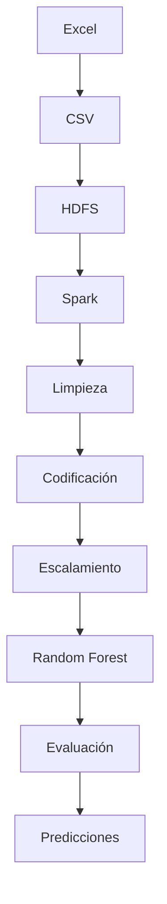

# 🏥 Predicción de la Estancia Hospitalaria (LOS) utilizando Apache Spark y Hadoop


---

# 📖 Descripción del Proyecto

Este proyecto implementa un **pipeline completo de Big Data y Machine Learning** para predecir la **duración de la estancia hospitalaria (Length of Stay - LOS)** de pacientes utilizando **Apache Spark MLlib** y **Hadoop HDFS**.

El objetivo es demostrar cómo construir un flujo de trabajo distribuido capaz de procesar grandes volúmenes de datos, entrenar modelos de Machine Learning y almacenar tanto los resultados como el modelo entrenado dentro de Hadoop.

Este proyecto está pensado como material educativo para estudiantes y profesionales interesados en:

- 🐧 Linux
- 🐘 Apache Hadoop
- ⚡ Apache Spark
- 🤖 Machine Learning
- 🏥 Analítica en Salud
- 📊 Ingeniería de Datos

---

# 🎯 Objetivo

Predecir la cantidad de días que permanecerá hospitalizado un paciente utilizando información clínica y demográfica.

Una predicción precisa permite:

- 🏥 Optimizar la asignación de camas.
- 💰 Reducir costos hospitalarios.
- 👨‍⚕️ Mejorar la planificación del personal médico.
- 📈 Optimizar el uso de recursos hospitalarios.
- ❤️ Mejorar la atención al paciente.


---

# 📂 Estructura del Proyecto

```
Prediccion-Estancia-Hospitalaria-LOS-Python/

│

├── Data/

│      hospital_covid_data.xlsx

│

├── upload_to_hdfs.py

├── hospital_los_prediction.py

└── README.md
```

---

# 🚀 Flujo del Proyecto

El proyecto se divide en dos etapas principales.

## 📦 1. Ingesta de Datos

Script:

```
upload_to_hdfs.py
```

Este script automatiza la carga de datos hacia Hadoop.

### Funciones principales

✅ Busca automáticamente archivos Excel.

✅ Convierte cada archivo a formato CSV.

✅ Elimina versiones anteriores almacenadas en HDFS.

✅ Carga automáticamente el nuevo archivo al sistema distribuido.

El destino es:

```
/user/hdoop/hospital/input
```

---

# 📊 2. Entrenamiento del Modelo

Script:

```
hospital_los_prediction.py
```

Este programa desarrolla todo el proceso de Machine Learning distribuido utilizando Apache Spark.

---

# ⚙ Paso 1. Crear la Sesión de Spark

Se crea el entorno distribuido mediante:

```python
SparkSession.builder
```

Esta sesión permite ejecutar procesos sobre Hadoop.

---

# 📥 Paso 2. Cargar los Datos

El conjunto de datos se lee directamente desde HDFS utilizando:

```python
spark.read.csv()
```

Se detectan automáticamente:

- Tipos de datos
- Encabezados
- Esquema del dataset

---

# 🧹 Paso 3. Tratamiento de Valores Faltantes

El script identifica automáticamente dos tipos de variables.

## Variables categóricas

Los valores nulos se reemplazan por:

```
Unknown
```

## Variables numéricas

Los valores faltantes se reemplazan por:

```
0
```

Esto evita errores durante el entrenamiento.

---

# 🔨 Paso 4. Ingeniería de Características

La variable objetivo es:

```
Stay (in days)
```

Posteriormente:

- Se convierte a tipo Double.
- Se eliminan registros sin variable objetivo.

---

## Codificación de Variables Categóricas

Las variables de texto son transformadas mediante:

```
StringIndexer
```

permitiendo que el algoritmo pueda utilizarlas.

---

## Construcción del Vector de Características

Todas las variables son combinadas mediante:

```
VectorAssembler
```

---

## Escalamiento

Posteriormente se normalizan utilizando:

```
StandardScaler
```

para mejorar el rendimiento del modelo.

---

# 🤖 Paso 5. Modelo de Machine Learning

Se utiliza un algoritmo de:

## 🌲 Random Forest Regressor

Configuración utilizada:

| Parámetro | Valor |
|------------|---------|
| Árboles | 100 |
| Profundidad máxima | 10 |

Random Forest fue seleccionado debido a que:

- Maneja relaciones no lineales.
- Es resistente al ruido.
- Funciona adecuadamente con variables mixtas.
- Presenta buen desempeño sin requerir gran ajuste de parámetros.

---

# ⚙ Paso 6. Pipeline de Spark

Todo el proceso es integrado dentro de un Pipeline.

```text
StringIndexer

↓

VectorAssembler

↓

StandardScaler

↓

Random Forest
```

Esto garantiza que exactamente las mismas transformaciones sean aplicadas durante entrenamiento y predicción.

---

# 📈 Paso 7. División del Dataset

Los datos se dividen en:

| Conjunto | Porcentaje |
|------------|------------|
| Entrenamiento | 80 % |
| Prueba | 20 % |

Utilizando una semilla fija para garantizar resultados reproducibles.

---

# 🎯 Paso 8. Entrenamiento

El modelo se entrena utilizando:

```python
pipeline.fit()
```

Spark distribuye automáticamente el procesamiento entre los recursos disponibles.

---

# 🔍 Paso 9. Predicciones

El modelo genera una estimación del número de días que permanecerá hospitalizado cada paciente.

---

# 📊 Paso 10. Evaluación

El desempeño del modelo se mide mediante tres métricas.

## RMSE

Error cuadrático medio.

Indica qué tan alejadas están las predicciones del valor real.

---

## MAE

Error absoluto medio.

Representa el error promedio en días de hospitalización.

---

## R²

Coeficiente de determinación.

Indica qué porcentaje de la variabilidad del problema logra explicar el modelo.

---

# 💾 Paso 11. Almacenamiento de Resultados

Las predicciones son almacenadas automáticamente en:

```
/user/hdoop/hospital/output/predictions
```

---

# 🧠 Paso 12. Almacenamiento del Modelo

El Pipeline completo es guardado en:

```
/user/hdoop/hospital/output/model
```

Esto permite reutilizar el modelo sin necesidad de volver a entrenarlo.

---

# 🛠 Tecnologías Utilizadas

| Tecnología | Función |
|------------|---------|
| Python | Lenguaje principal |
| Pandas | Conversión de Excel |
| Apache Spark | Procesamiento distribuido |
| Spark MLlib | Machine Learning |
| Hadoop HDFS | Almacenamiento distribuido |
| Random Forest | Modelo predictivo |

---

# 📈 Flujo de Machine Learning



---


